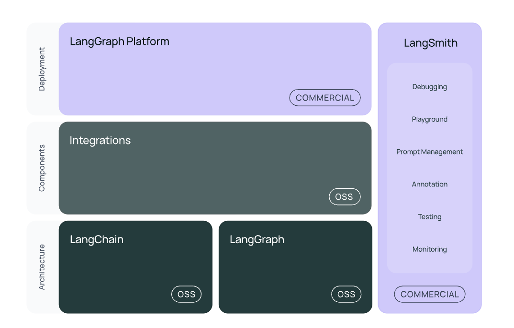

## 환경설정

- 환경설정을 잘하자.
- visual studio 환경설정 json
- Chatgpt API
- Langsmith API
- pyenv
- potry

## [Langchain intorudiction](https://python.langchain.com/docs/introduction/)

### introduction

- LangChain 은 대규모 언어 모델(LLM)을 사용하여 애플리케이션을 개발하기 위한 프레임워크

- LangChain은 LLM 애플리케이션 라이프사이클의 모든 단계를 단순화합니다.

    - 개발 : LangChain의 오픈소스 빌딩 블록 , 구성 요소 및 타사 통합을 사용하여 애플리케이션을 빌드합니다 . LangGraph를 사용하여 일류 스트리밍 및 인간 참여 지원이 있는 상태 있는 에이전트를 빌드합니다.

    - 생산화 : LangSmith를 사용하여 체인을 검사, 모니터링 및 평가함으로써 지속적으로 최적화하고 자신감을 가지고 배포할 수 있습니다.

    - 배포 : LangGraph Cloud를 사용하여 LangGraph 애플리케이션을 프로덕션에 바로 사용할 수 있는 API와 Assistant로 전환하세요 .

- 생태계
    - langsmith : 트래킹 QA
    - langraph : 다중협업 
    - langserve : 모델 배포

- langchain-core: 기본 추상화와 LangChain 표현 언어.
통합 패키지(예 langchain-openai: langchain-anthropic, 등): 중요한 통합은 LangChain 팀과 통합 개발자가 공동으로 유지 관리하는 가벼운 패키지로 분할되었습니다.
- langchain: 애플리케이션의 인지 아키텍처를 구성하는 체인, 에이전트 및 검색 전략입니다.
- langchain-community: 커뮤니티에서 유지 관리하는 타사 통합입니다.
- LangGraph : 그래프에서 단계를 에지와 노드로 모델링하여 LLM을 사용하여 견고하고 상태가 있는 멀티 액터 애플리케이션을 구축합니다. LangChain과 원활하게 통합되지만 LangChain 없이도 사용할 수 있습니다.
- LangGraphPlatform : LangGraph로 구축된 LLM 애플리케이션을 프로덕션에 배포합니다.
- LangSmith : LLM 애플리케이션을 디버깅, 테스트, 평가, 모니터링할 수 있는 개발자 플랫폼입니다.

### chapter3 Langchain 시작
- API 연결하기, Langsmith, OpenAI

---

#### ChatOpenAI

OpenAI 사의 채팅 전용 Large Language Model(llm) 입니다.

객체를 생성할 때 다음을 옵션 값을 지정할 수 있습니다. 옵션에 대한 상세 설명은 다음과 같습니다.

`temperature`

- 사용할 샘플링 온도는 0과 2 사이에서 선택합니다. 0.8과 같은 높은 값은 출력을 더 무작위하게 만들고, 0.2와 같은 낮은 값은 출력을 더 집중되고 결정론적으로 만듭니다.

`max_tokens`

- 채팅 완성에서 생성할 토큰의 최대 개수입니다.

`model_name`: 적용 가능한 모델 리스트
- `gpt-4o`
- `gpt-4o-mini`
- `o1-preview`, `o1-preview-mini`: tier5 계정 이상만 사용 가능. $1,000 이상 충전해야 tier5 계정이 됩니다.

- 인텔리전스 : gpt-40 보다 gpt-4 turbo가 더 좋은 경우가 많다.

- 링크: https://platform.openai.com/docs/models

---
#### Token

- BPE : 한글자씩 확장시켜 나아가면서 기존에 있는 word를 sub-group형태로 묶어주는 형식

### context window, 입력토큰

### chapter 4

#### PromptTemplate